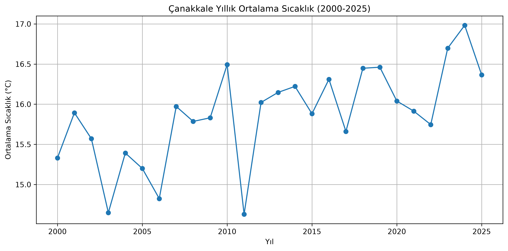
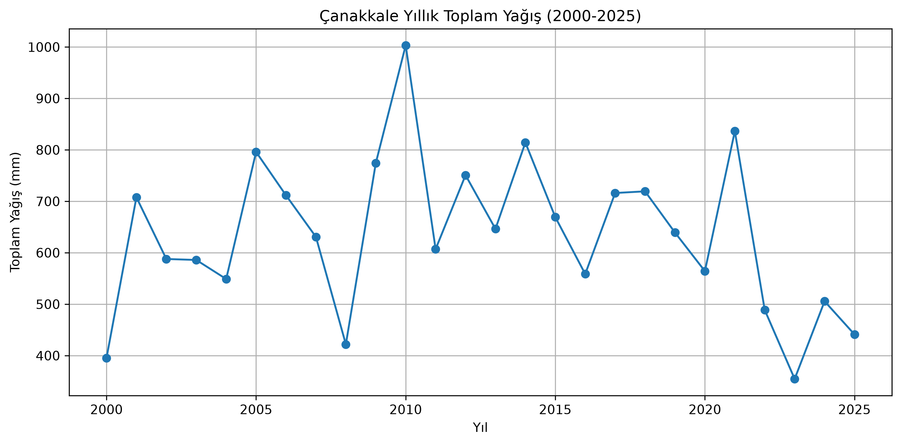
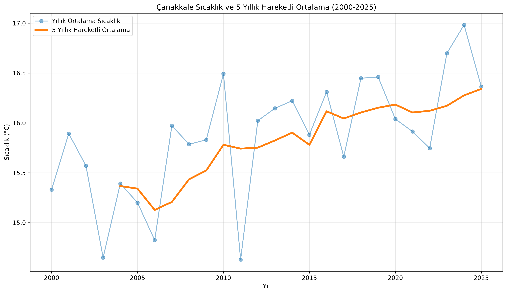
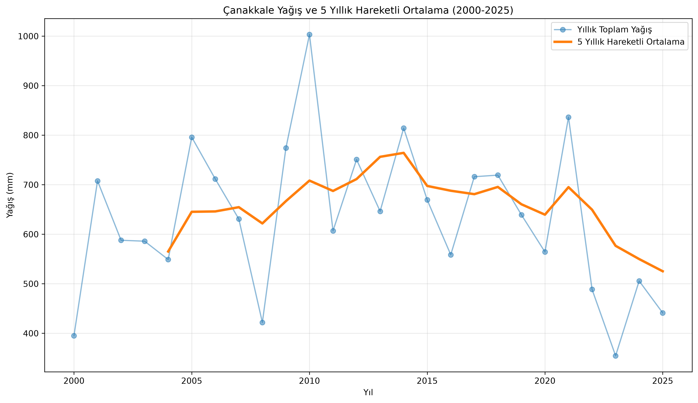
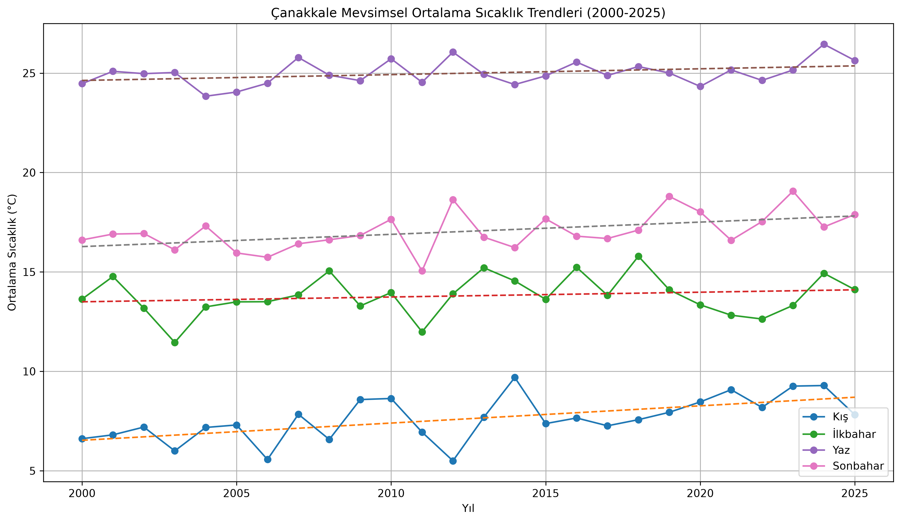
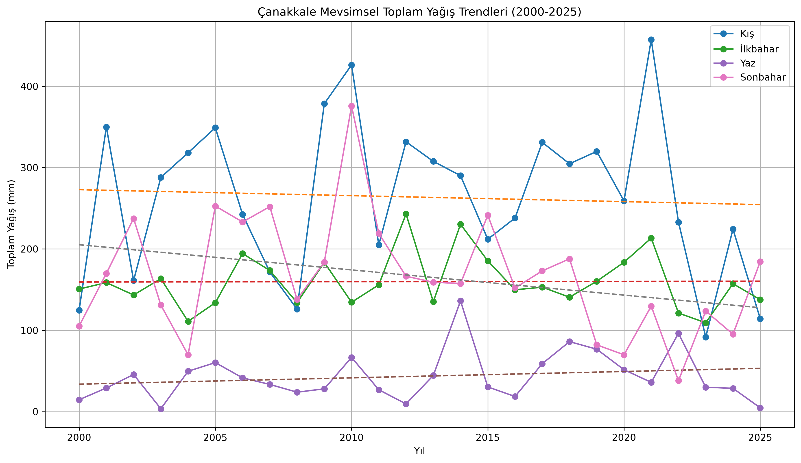
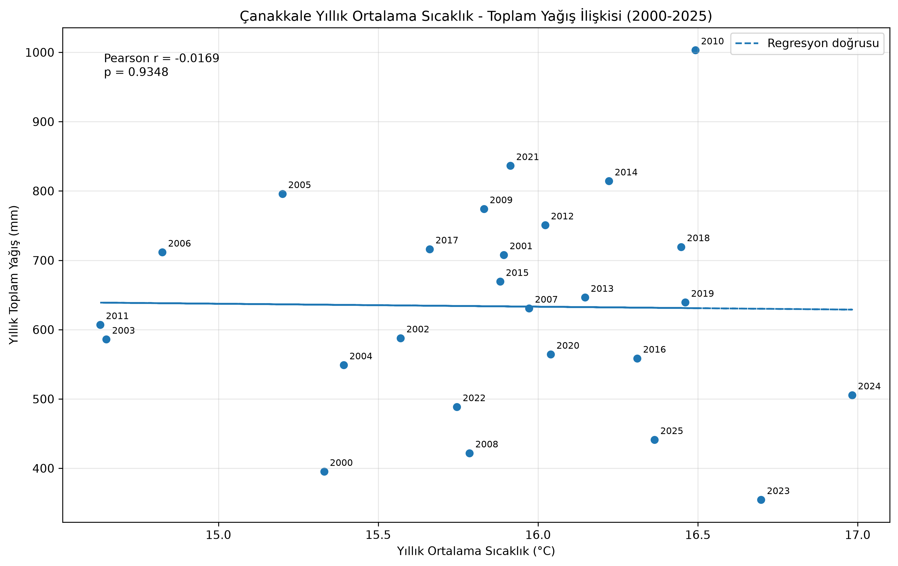
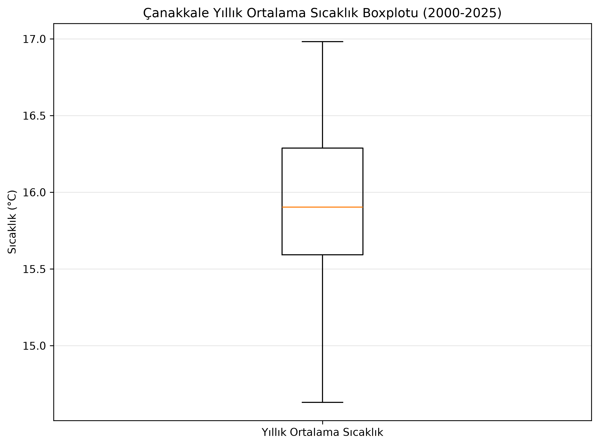
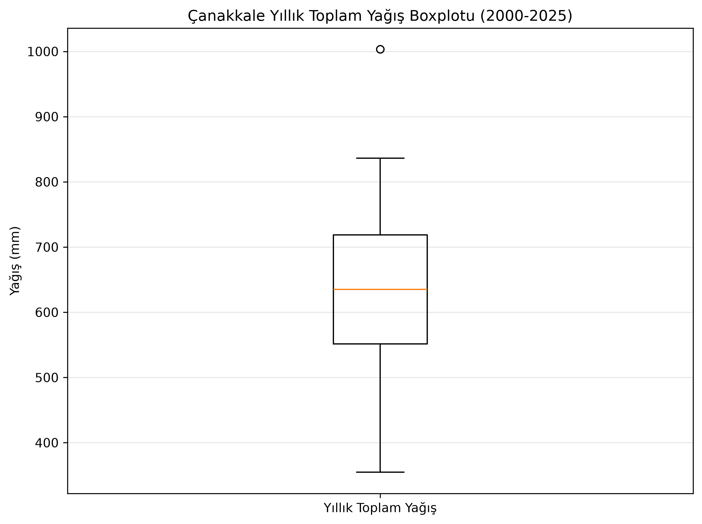

# Çanakkale'nin 2000–2025 Dönemi İklim Verilerinin İstatistiksel Analizi

## 📌 Proje Hakkında

Bu proje, **Çanakkale'nin 2000–2025 yılları arasındaki sıcaklık ve yağış verilerinin istatistiksel yöntemlerle incelenmesini** amaçlamaktadır.

Aylık iklim verileri kullanılarak yıllık ve mevsimsel değişimler, trendler, hareketli ortalamalar, aykırı değerler ve sıcaklık ile yağış arasındaki ilişki analiz edilmiştir.

---

## 📊 Kullanılan Veri

Veriler **Copernicus Climate Change Service (C3S) – ERA5-Land** veri setinden elde edilmiştir.

| Özellik         | Değer              |
| --------------- | ------------------ |
| Konum           | Çanakkale, Türkiye |
| Dönem           | 2000–2025          |
| Gözlem sayısı   | 312 aylık gözlem   |
| Değişkenler     | Sıcaklık, Yağış    |
| Sıcaklık birimi | °C                 |
| Yağış birimi    | mm                 |

---

## 🛠️ Kullanılan Teknolojiler

* **Python**
* **Pandas** – Veri işleme
* **NumPy** – Sayısal hesaplamalar
* **Xarray** – NetCDF veri işleme
* **Matplotlib** – Veri görselleştirme
* **SciPy** – İstatistiksel analiz
* **ERA5-Land** – İklim verisi

---

## 🔎 Yapılan Analizler

* Tanımlayıcı istatistikler
* Yıllık sıcaklık ve yağış analizi
* Doğrusal trend analizi
* Mevsimsel trend analizi
* 5 yıllık hareketli ortalama
* Pearson korelasyon analizi
* IQR ile aykırı değer analizi
* Boxplot analizi

---

## 📈 Önemli Bulgular

### 🌡️ Sıcaklık

| İstatistik     |    Değer |
| -------------- | -------: |
| Ortalama       | 15.86 °C |
| Medyan         | 15.33 °C |
| Standart Sapma |  6.97 °C |
| Minimum        |  2.20 °C |
| Maksimum       | 27.98 °C |

**Sıcaklık trendi:**

* Eğimi: **+0.0504 °C/yıl**
* Değişim: **+0.504 °C/on yıl**
* R²: **0.4158**
* p-değeri: **0.0004**

Sonuç olarak sıcaklıklarda **istatistiksel olarak anlamlı bir artış eğilimi** bulunmuştur.

### 🌧️ Yağış

| İstatistik     |     Değer |
| -------------- | --------: |
| Ortalama       |  52.80 mm |
| Medyan         |  41.80 mm |
| Standart Sapma |  47.16 mm |
| Minimum        |   0.33 mm |
| Maksimum       | 298.32 mm |

**Yağış trendi:**

* Eğimi: **−3.014 mm/yıl**
* Değişim: **−30.14 mm/on yıl**
* R²: **0.0231**
* p-değeri: **0.4581**

Yağışta azalış yönünde eğilim görülmesine rağmen trend **istatistiksel olarak anlamlı değildir**.

### 🍂 Mevsimsel Analiz

| Mevsim   | Ortalama Sıcaklık | Ortalama Yağış |
| -------- | ----------------: | -------------: |
| Kış      |           7.62 °C |       87.90 mm |
| İlkbahar |          13.80 °C |       53.30 mm |
| Yaz      |          25.00 °C |       14.51 mm |
| Sonbahar |          17.05 °C |       55.50 mm |

Anlamlı sıcaklık trendleri:

* **Kış:** +0.0866 °C/yıl, p = 0.0011
* **Sonbahar:** +0.0616 °C/yıl, p = 0.0093

### 📉 Korelasyon

Sıcaklık ve yağış arasındaki Pearson korelasyonu:

**r = −0.0169, p = 0.9348**

Sonuç, iki değişken arasında **istatistiksel olarak anlamlı doğrusal ilişki bulunmadığını** göstermektedir.

2010 yılı çıkarıldığında:

**r = −0.1456, p = 0.4873**

Sonuç yine anlamlı değildir.

### 📌 Aykırı Değer

IQR yöntemi sonucunda **2010 yılı yağış değeri aykırı gözlem** olarak belirlenmiştir.

---

## 📊 Görselleştirmeler

### Yıllık Sıcaklık



### Yıllık Yağış



### Sıcaklık – 5 Yıllık Hareketli Ortalama



### Yağış – 5 Yıllık Hareketli Ortalama



### Mevsimsel Sıcaklık Trendleri



### Mevsimsel Yağış Trendleri



### Sıcaklık – Yağış Korelasyonu



### Yıllık Sıcaklık Boxplot



### Yıllık Yağış Boxplot



---

## 📁 Proje Yapısı

```text
Turkiye_Iklim_Analizi/
│
├── data/
│   └── canakkale_2000_2025.csv
│
├── graphs/
│   ├── mevsimsel_sicaklik_trendleri.png
│   ├── mevsimsel_yagis_trendleri.png
│   ├── sicaklik_5y_hareketli_ortalama.png
│   ├── sicaklik_yagis_korelasyon.png
│   ├── yagis_5y_hareketli_ortalama.png
│   ├── yillik_sicaklik_2000_2025.png
│   ├── yillik_sicaklik_boxplot.png
│   ├── yillik_yagis_2000_2025.png
│   └── yillik_yagis_boxplot.png
│
├── src/
│   ├── canakkale_csv_olustur.py
│   ├── canakkale_veri_topla.py
│   ├── istatistik_analizi.py
│   ├── mevsim_analizi.py
│   ├── test_copernicus.py
│   ├── veri_incele.py
│   └── veri_indir.py
│
├── .gitignore
└── README.md
```

---

## 🎯 Sonuç

2000–2025 döneminde Çanakkale'de sıcaklıkların **istatistiksel olarak anlamlı şekilde arttığı**, yağışlarda ise **istatistiksel olarak anlamlı olmayan bir azalış eğilimi** olduğu görülmüştür.

Mevsimsel analizlerde özellikle **kış ve sonbahar sıcaklıklarında anlamlı artışlar** tespit edilmiştir.

Bu proje, Python kullanılarak gerçek iklim verileri üzerinde **istatistiksel analiz, trend analizi, hipotez testi, korelasyon, aykırı değer analizi ve veri görselleştirme** uygulamalarını içermektedir.

---

## 👨‍💻 Geliştirici

**Ahmet Ünlü**

**İstatistik Öğrencisi | Veri Analizi ve Veri Bilimi**
